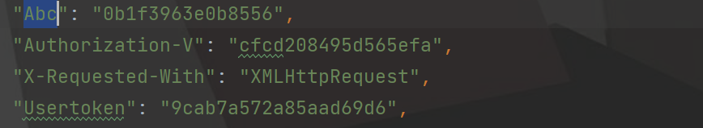

## 有问题issues
还处在初期阶段,后面慢慢更新,有好的获取思路可以issues
## 日志

**2023-12-19**

+ 完成选择题提交
+ 后面会补全
+ 写的有点乱,后面调整一下

## 声明

请遵循MIT协议

## 使用

```angular2html
pip install -r requirements.txt
```

配置以下(自行抓,**主要是调试怕被封号,没有多余的wx号**):

运行main.py