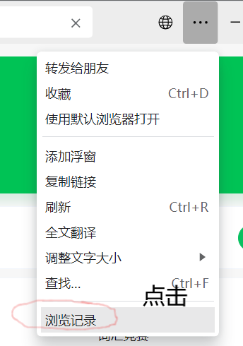
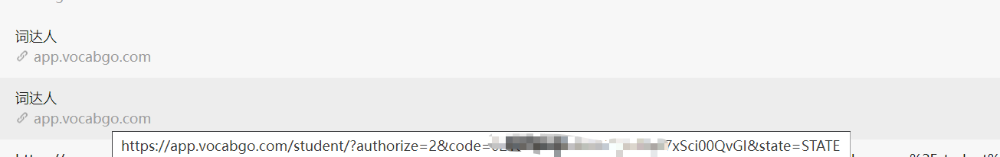
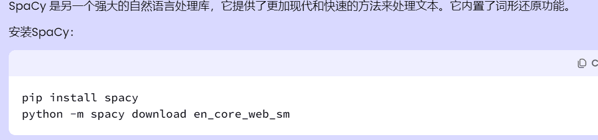
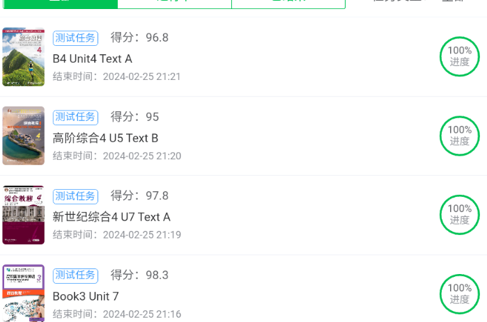
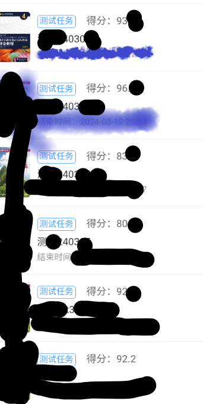

## 欢迎issues,让我更好完善脚本
### 点start加速更新
`词达人过班级任务,自学任务`
- [x] 自动过自学任务
- [x] 过班级任务
- [ ] 转原型的第三方库不是很好用
- [ ] **自建任务完成不了 ！！！** 判断是否为自建任务的方法,看该班级测试的**单词是否超过50个**如果是则为自建任务

**目前存在的bug**  
+ 转成单词原型没有好用的库
+ 有个题型没思路(正确率没有100%)

**2024-03-05**
+ 过自建任务,正确率下降了,有个题型正确率掉了挺多(情况好90＋，不好80+，自己看图)
+ 思路还可以优化
+ 测试中
+ 只更新了exe,过两天传源码
+ 头大,**只更新了自建班级测试！！！**

**2024-03-03**
+ 小更新

**2024-02-28**
+ **解决一大难题**,小白获取code(也就是token的问题)
+ 解决code bug


**2024-02-02**
+ 模拟器把wx号封了(就刷了一个xpose框架) 
+ 交流加(3288892500) 

**2024-02-01**
+ 添加加班级任务
+ start太少了,我以为没人用懒得更新。
<details> <summary> <b>日志(点击查看进程)</b> </summary>

**2024-02-27**
+ 修复自选任务bug

**2024-02-25**
+ 打包exe

**2024-02-25**
+ 95+正确率

**2024-02-25**
+ 测试中...
+ 修bug,同一个接口返回两种格式数据,服了
+ 已解决

**2024-02-24**
+ 大幅度提升正确率,解决查不到单词bug
+ 提高补全单词正确率
+ 解决汉译英走google,提高正确率
+ 准备初次打包

**2024-02-23**
+ 句子补全题型
+ 还是单词装原型bug,查单词会报错
+ 准备过自建任务

**2024-02-22**
+ 解决部分代码冗余
+ 修复已知bug
+ 增加一些错误提示

**2024-02-21**
+ 现在存在问题:
  - 补全句子题型
  - token小白不好获取

**2024-02-20**
+ 完成班级测试大部分题型

**2024-02-18**
+ 将班级任务和自学任务分开
+ 先将大致功能完成后在解决bug
+ 晚上在调试
+ 过班级任务的学习任务


**2024-02-11**
+ 仅供简单使用,明天完善功能
+ 完成简单的班级任务
+ 后面重构一下(班级任务和自学任务)  


**2024-01-03**
+ 修补没测试bug
**2023-12-26**
+ 添加无需抓包的方法

**2023-12-24**
+ 修复服务器放回错误数据

**2023-12-24**
+ 解决一部分”单词填空“bug

**2023-12-23**
+ 新增选择全部单词
+ 过单词阅读卡片

**2023-12-23**
+ 获取 abc加密方式
+ 获取header '授权‘ 加密(目前看来是固定)  
+ 暂时无法解决的bug,用第三方库个别单词无法转成原型,需要手动过该题目

**2023-12-22**
+ 修复单选bug  
+ 修复填充单词bug

**2023-12-21**

+ 汉译英
+ 英译汉
+ 听力
+ 填写句子
+ complete单词
+ 稳定85分以上

**2023-12-19**

+ 完成选择题提交
+ 后面会补全
+ 写的有点乱,后面调整一下
</details>


## 声明

请遵循MIT协议,仅供学习参考。

## 使用
> 目前默认完成所有班级任务,或自学任务,目前正确率应该有95%。
**Tip**:对会抓token的友好，没有挤掉的风险,不建议一次把自学任务刷完(号被风控,前车之鉴)

获取token:   

方法一：获取微信code: 打开pc端微信,点击下面链接(发给自己),查看浏览记录
```angular2html
https://open.weixin.qq.com/connect/oauth2/authorize?appid=wx2a694105a6abbe6d&redirect_uri=https%3A%2F%2Fapp.vocabgo.com%2Fstudent%2F%3Fauthorize%3D0&response_type=code&scope=snsapi_userinfo&state=STATE```
```


code只能使用一次,且在运行时不能进入词达人(会挤掉),复制下面code到config.json中    

鼠标悬浮在上面,链接就会出来


方法二:  
自己抓包,抓token(如果在手机端抓的token,可以在手机端查看,pc端同理)很简单

方法三:
B站上cdr付费使用的软件,可以获取token(不如自己抓包)。风险自己承担  

**配置config.json**
```angular2html
{
  "token": "0a111712cacd923cdc39cdf93accb20cc",
  "code": "011RXfGa12geGG0C1QFa1cUUnq3RXfGr", // 不会抓包的配置这个
  "class_task": true, // 是否完成班级任务
  "myself_task": true // 是否完成自学任务
}
```


配置环境,不想配置环境的话releases有打包好的exe程序(只需要抓token)
```angular2html
pip install -r requirements.txt
```
记得安装模型

运行main.py (随机1~5秒提交一次答案)  
  
## 结果
随机抽取5本书的一个单元的全部题型,正确率95+(有极个别题过不了,需要手动过)

自建任务


## start
[](https://starchart.cc/github123666/cidaren)
