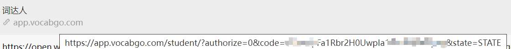

## 欢迎issues,让我更好完善脚本
`词达人过班级任务,自学任务`
- [x] 自动过自学任务
- [x] 过班级任务
- [ ] 添加可视化
- [ ] 使用更简洁的方法去实现单词转换(环境太乱了)
- [ ] 修复已知bug
- [ ] 扩展脚本
- [ ] 汉转英没有好的接口(目前只能利用google,正确率不高的原因)
- [ ] 转原型的第三方库不是很好用
- [ ] 提高正确率 

**2024-02-18**
+ 将班级任务和自学任务分开
+ 先将大致功能完成后在解决bug
+ 晚上在调试
+ 过班级任务的学习任务

**2024-02-11**
+ 仅供简单使用,明天完善功能
+ 完成简单的班级任务
+ 后面重构一下(班级任务和自学任务)  

**2024-02-02**
+ 模拟器把wx号封了(就刷了一个xpose框架) 
+ 交流加QQ：3288892500 

**2024-02-01**
+ 添加加班级任务
+ start太少了,我以为没人用懒得更新。
<details> <summary> <b>日志(点击查看进程)</b> </summary>

**目前存在的bug**  
+ 环境问题,google要挂梯子
+ 转成单词原型没有好用的库

**2024-01-03**
+ 修补没测试bug
**2023-12-26**
+ 添加无需抓包的方法

**2023-12-24**
+ 修复服务器放回错误数据

**2023-12-24**
+ 解决一部分”单词填空“bug

**2023-12-23**
+ 新增选择全部单词
+ 过单词阅读卡片

**2023-12-23**
+ 获取 abc加密方式
+ 获取header '授权‘ 加密(目前看来是固定)  
+ 暂时无法解决的bug,用第三方库个别单词无法转成原型,需要手动过该题目

**2023-12-22**
+ 修复单选bug  
+ 修复填充单词bug

**2023-12-21**

+ 汉译英
+ 英译汉
+ 听力
+ 填写句子
+ complete单词
+ 稳定85分以上

**2023-12-19**

+ 完成选择题提交
+ 后面会补全
+ 写的有点乱,后面调整一下
</details>


## 声明

请遵循MIT协议,仅供学习参考。

## 使用
> 当前是无脑提交,建议用小号测试

**Tip1**:有些单词(什么双写加ing的.....)会提交不了,需要手动提交.**推荐刷分使用**   
**Tip2**:开梯子运行(有个题型走的google翻译)    
方法一：获取微信code,拼手速,点下面授权cdr的链接标签页转一圈半就关掉,打开其他网页百度什么的,查看浏览记录(**没有跳转到 cdr home 页面的记录则为成功**) 
```angular2html
https://open.weixin.qq.com/connect/oauth2/authorize?appid=wx2a694105a6abbe6d&redirect_uri=https%3A%2F%2Fapp.vocabgo.com%2Fstudent%2F%3Fauthorize%3D2&response_type=code&scope=snsapi_userinfo&state=STATE
```
配置config.json      
code只能使用一次,且在运行时不能进入词达人(会挤掉)


方法二:  
自己抓包,抓token(如果在手机端抓的token,可以在手机端查看,pc端同理)
配置config.json里面token  
**配置config.json**
```angular2html
{
  "token": "0a111712cacd923cdc39cdf93accb20cc",
  "code": "011RXfGa12geGG0C1QFa1cUUnq3RXfGr", // 不会抓包的配置这个
  "class_task": true, // 是否完成班级任务
  "myself_task": true // 是否完成自学任务
}
```


配置环境
```angular2html
pip install -r requirements.txt
```
运行main.py (随机1~3秒提交一次答案)  
  

  

班级测试
